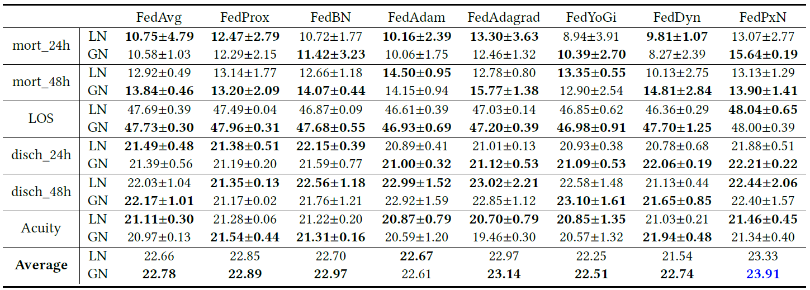
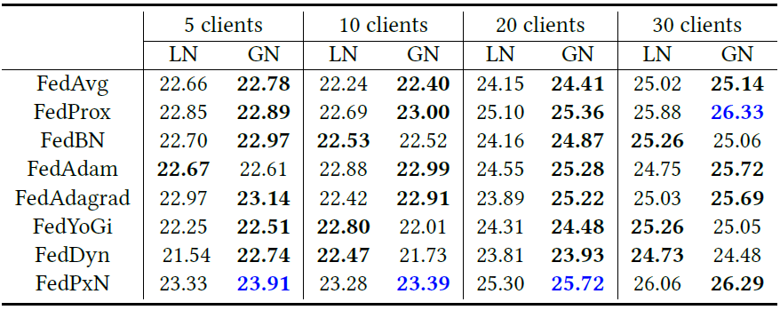
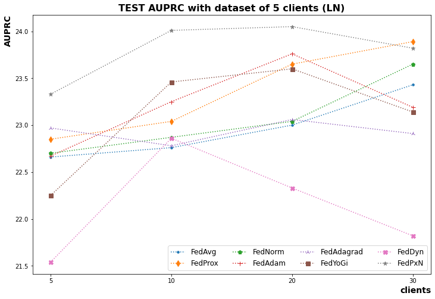
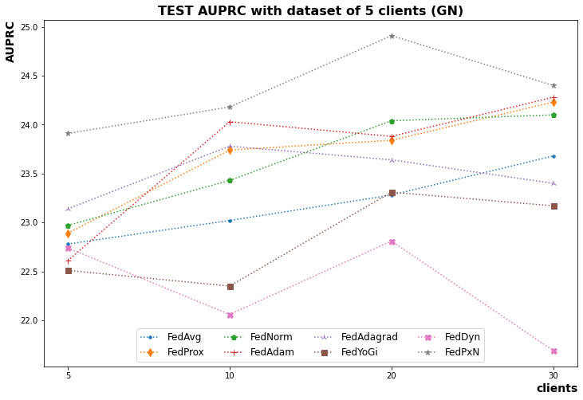
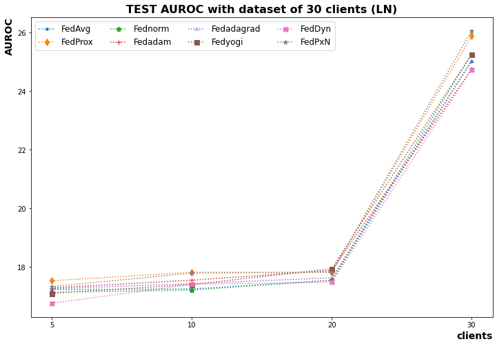
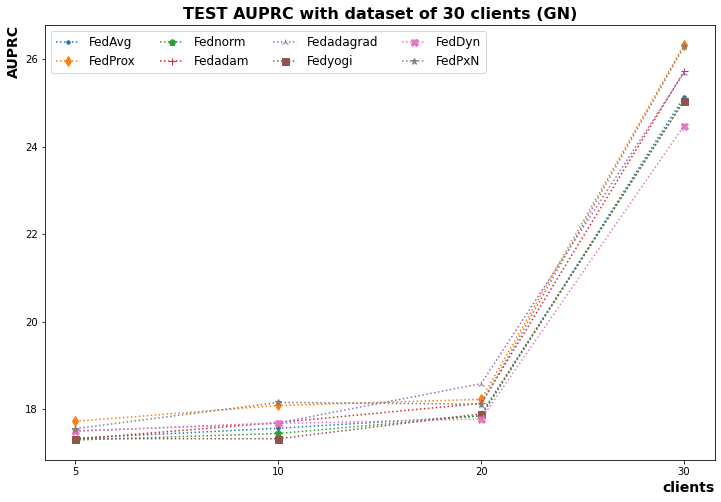

# Experiment results
In the page, We show the PRAUC results of the eICU.

## The AURPC results for the eICU dataset using the data of the five largest clients
It is the AUPRC results for the eICU dataset using the data of five largest clients. For each FL method, bold indicates the better normalization techniques (LN or GN). We indicate the highest average AUPRC results for all six tasks in blue.

  

## The AURPC results with more clients
It is Average AUPRC results for all six tasks for the eICU dataset using the data of the $5, 10, 20, 30$ largest clients. For each FL method and each client setting, bold indicates the better normalization (LN or GN). We indicate the highest AUPRC for each client setting in blue.

  

## Testing on the top-5 client & top-30 client datasets
We evaluated the AUPRC of different FL methods on the test set from the 5, 30 largest clients.

### Testing on the top-5 client dataset

  
  

### Testing on the top-30 client dataset

  
  

